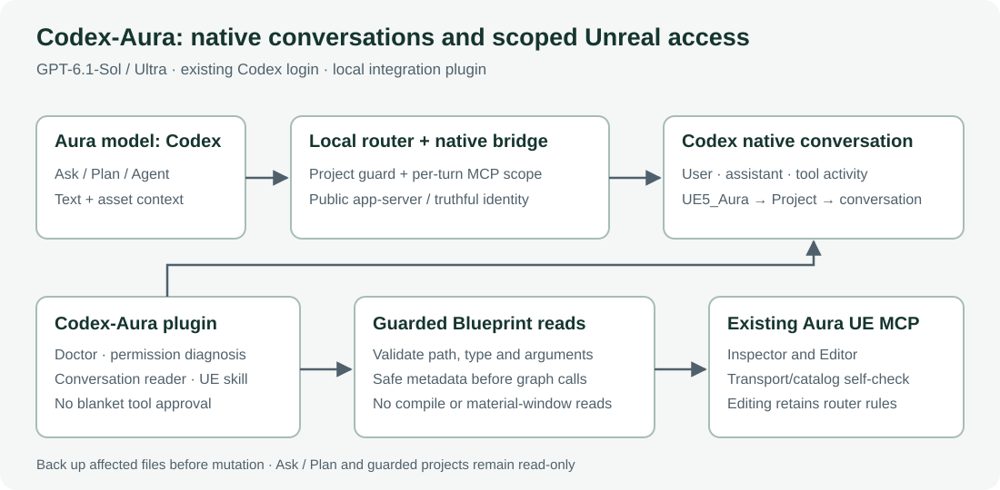

# Codex-Aura

让 Aura 的模型菜单选择 **Codex**，使用已有 Codex 登录调用 **GPT-6.1-Sol / Ultra**，并在 Codex 中查看真实对话。提供 MCP 自检、权限诊断、蓝图结构读取和 UE 操作技能。

[完整中文说明](docs/README.zh-CN.md) · [English](README.en.md) · [更新记录](docs/RELEASE_NOTES.zh-CN.md) · [MIT 许可](LICENSE)



## 0.1.5

修复新对话提示 **“This chat could not be saved”** 的问题。新 Codex 线程在首轮生成前可能尚未落盘；现在先保存真实线程标识并完成生成，再关联 Project、同步工作区和标题。可选同步共用 5 秒期限，失败时保留回答。云端保存回执仍必须校验成功，不能把失败当成已保存。

本机完成了新对话及第二轮续聊的实际保存、读回验证。本机修复版本回归 **181 项通过、0 项失败**；公开版本补充默认路径和配置边界测试后，**185 项全部通过**。

## 安装前提

本项目是现有 **Aura 1.0.6 / DSH 路由的集成补丁**。需要 Windows、Node.js、已登录的 Codex CLI、Aura UE 插件和兼容的 `AuraChatTap.mjs`。仓库不包含这些产品或完整路由。

测试环境为 Node.js 24.14.1；原生协议曾在 Codex CLI 0.159.2 验证，0.1.5 的插件加载和保存验证使用 0.159.0-alpha.12.1。Aura 更新后如补丁位置不匹配，安装器会停止。详细限制及操作边界见[中文说明](docs/README.zh-CN.md)。

## 快速开始

在仓库根目录创建 `config.local.json`，替换为本机实际路径：

```json
{
  "auraRoot": "C:\\Apps\\aura-client",
  "routerRoot": "C:\\Tools\\AuraRouter",
  "routerUrl": "http://127.0.0.1:41777",
  "testProject": "C:\\Projects\\MyGame",
  "cliPath": ""
}
```

`routerRoot` 必须指向兼容的路由目录。`testProject` 是诊断配置，不授予 UE 写权限。自定义配置应在启动 Codex 前通过 `CODEX_AURA_CONFIG` 指定，或放到默认 `%LOCALAPPDATA%\Aura\CodexAura\config.json`；`--config` 仅选择本次安装文件。

```powershell
$env:CODEX_AURA_CONFIG = (Resolve-Path .\config.local.json).Path
node .\codex-aura\scripts\install.mjs --config .\config.local.json --dry-run
node .\codex-aura\scripts\install.mjs --config .\config.local.json
```

保存安装结果的 `backupDir`。默认备份位于 `%LOCALAPPDATA%\Aura\CodexAura\backups`，可用 `--backup-root` 指定其他位置。重新加载已有路由，在 Codex 新开对话或重启以更新工具目录，在 Aura 刷新后选择 **Codex**。完整安装、恢复和 Project 分类步骤见[中文说明](docs/README.zh-CN.md)。

## 使用与开发

在 Codex 请求“检查 Aura MCP 和权限”“查看 Aura 对话”或“解释这个蓝图”。6 个 MCP 工具均只读；Ask / Plan 保持只读，Agent 编辑仍依赖现有路由授权和真实工程范围。

代码只使用 Node.js 内置模块，无需安装 npm 依赖。在仓库根目录运行隔离回归测试：

```powershell
npm test
```

`codex-aura/` 包含插件、MCP、技能和安装 / 恢复；`codex-model/` 包含模型菜单补丁、原生对话桥接及 guard 测试。参考 [DSH-Aura](https://github.com/TaoKing2023/DSH-Aura) 的功能与操作规范，第三方边界见 [THIRD_PARTY_NOTICES.md](THIRD_PARTY_NOTICES.md)。
